# 商品详情页的静态化:

> 学习目标:
>
> - 商品详情页的页面静态化实现
> - celery 异步处理页面静态化实现

商品详情页的访问依然很多, 所以我们同样考虑采用页面静态化技术

但是和首页的静态化技术相比, 又有所不同:

**商品详情页的每次静态化由运营人员在编辑商品信息时触发**

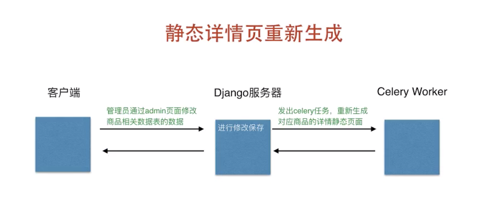

### 第一步: 实现公共方法, 获取商品的分类菜单:

> 将形成商品类别部分的数据封装成一个公共函数
>
> 在 goods / utils.py 中增加代码: 

```python
# 将我们之前写的获取商品分类的代码,提取出来一部分, 封装成一个独立的函数: 

# 导入:
from django import http
from collections import OrderedDict
from goods.models import GoodsCategory
from goods.models import GoodsChannel, SKU
from goods.models import  SKUImage, SKUSpecification
from goods.models import  GoodsSpecification, SpecificationOption


def get_goods_and_spec(sku_id):

    # ======== 获取该商品和该商品对应的规格选项id ========
    try:
        # 根据 sku_id 获取该商品(sku)
        sku = SKU.objects.get(id=sku_id)
        # 获取该商品的图片
        sku.images = SKUImage.objects.filter(sku=sku)
    except Exception as e:
        return JsonResponse({'code':400,
                             'errmsg':'获取数据失败'})

    # 获取该商品的所有规格: [颜色, 内存大小, ...]
    sku_specs =SKUSpecification.objects.filter(sku=sku).order_by('spec_id')

    sku_key = []
    # 获取该商品的所有规格后,遍历,拿取一个规格

    for spec in sku_specs:
        # 规格 ----> 规格选项 ----> 选项id  ---> 保存到[]
        sku_key.append(spec.option.id)

    # ======== 获取类别下所有商品对应的规格选项id ========
    # 根据sku对象,获取对应的类别
    goods = sku.goods

    # 获取该类别下面的所有商品
    skus = SKU.objects.filter(goods=goods)

    dict = {}
    for temp_sku in skus:
        # 获取每一个商品(temp_sku)的规格参数
        s_specs = SKUSpecification.objects.filter(sku=temp_sku).order_by('spec_id')

        key = []
        for spec in s_specs:
            # 规格 ---> 规格选项 ---> 规格选项id ----> 保存到[]
            key.append(spec.option.id)

        # 把 list 转为 () 拼接成 k : v 保存到dict中:
        dict[tuple(key)] = temp_sku.id

    # ======== 在每个选项上绑定对应的sku_id值 ========
    specs = GoodsSpecification.objects.filter(goods=goods).order_by('id')

    for index, spec in enumerate(specs):
        # 复制当前sku的规格键
        key = sku_key[:]
        # 该规格的选项
        spec_options = SpecificationOption.objects.filter(spec=spec)

        for option in spec_options:
            # 在规格参数sku字典中查找符合当前规格的sku
            key[index] = option.id
            option.sku_id = dict.get(tuple(key))

        spec.spec_options = spec_options

    return goods, specs, sku

def get_categories():

    # ======== 生成上面字典格式数据 ========
    # 第一部分: 从数据库中取数据:
    # 定义一个有序字典对象
    dict = OrderedDict()

    # 对 GoodsChannel 进行 group_id 和 sequence 排序, 获取排序后的结果:
    channels = GoodsChannel.objects.order_by('group_id', 'sequence')

    # 遍历排序后的结果: 得到所有的一级菜单( 即,频道 )
    for channel in channels:
        # 从频道中得到当前的 组id
        group_id = channel.group_id  

        # 判断: 如果当前 组id 不在我们的有序字典中:
        if group_id not in dict:
            # 我们就把 组id 添加到 有序字典中
            # 并且作为 key值, value值是
            # {'channels': [], 'sub_cats': []}
            dict[group_id] =  {
                                 'channels': [],
                                 'sub_cats': []
                               }

        # 获取当前频道的分类名称
        cat1 = channel.category

        # 给刚刚创建的字典中, 追加具体信息:
        # 即, 给'channels' 后面的 [] 里面添加如下的信息:
        dict[group_id]['channels'].append({
            'id':   cat1.id,
            'name': cat1.name,
            'url':  channel.url
        })
        cat2s = GoodsCategory.objects.filter(parent=cat1)
        # 根据 cat1 的外键反向, 获取下一级(二级菜单)的所有分类数据, 并遍历:
        for cat2 in cat2s:
            # 创建一个新的列表:
            cat2.sub_cats = []
            # 获取所有的三级菜单
            cat3s = GoodsCategory.objects.filter(parent=cat2)
            # 遍历
            for cat3 in cat3s:
                # 把三级菜单保存到cat2对象的属性中.
                cat2.sub_cats.append(cat3)
            # 把cat2对象保存到对应的列表中
            dict[group_id]['sub_cats'].append(cat2)

    return dict
```

### 第二步: 商品详情页, 我们使用异步任务来进行:

> 所以我们在 celery_tasks 中, 定义一个新的异步任务, 起名为 html:

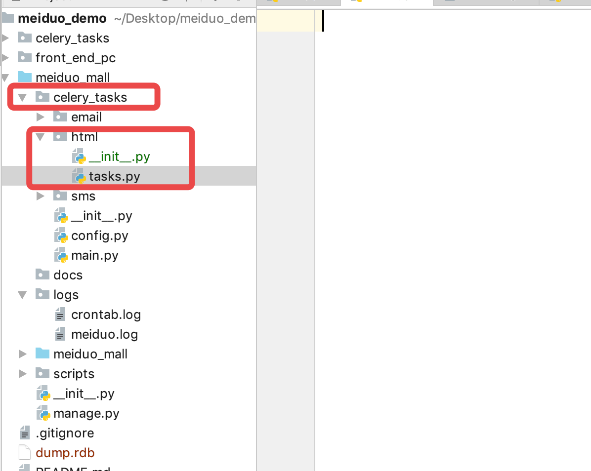

### 第三步: 实现异步任务函数:

> 实现静态化异步任务，在 celery_tasks 中新建 html / tasks.py 任务

```python
import os
from goods.models import SKU
from django.conf import settings
from django.template import loader
from celery_tasks.main import celery_app
from goods.utils import get_categories, get_goods_and_spec


# 定义一个生成静态化页面的函数, 该函数需要用装饰器装饰:
@celery_app.task(name='generate_static_sku_detail_html')
def generate_static_sku_detail_html(sku_id):
    """
    生成静态商品详情页面
    :param sku_id: 商品id值
    """
    # 商品分类菜单
    dict = get_categories()

    goods, specs, sku = get_goods_and_spec(sku_id)

    # 渲染模板，生成静态html文件
    context = {
        'categories': dict,
        'goods': goods,
        'specs': specs,
        'sku': sku
    }

    # 加载 loader 的 get_template 函数, 获取对应的 detail 模板
    template = loader.get_template('detail.html')
    # 拿到模板, 将上面添加好的数据渲染进去.
    html_text = template.render(context)
    # 拼接模板要生成文件的位置:
    file_path = os.path.join(settings.GENERATED_STATIC_HTML_FILES_DIR, 'goods/'+str(sku_id)+'.html')
    # 写入
    with open(file_path, 'w') as f:
        f.write(html_text)
```

##### 上面的代码中, 我们最后要将生成的静态页面全部保存到 front_end_pc 下面的 goods 目录下

##### 并且是以 sku_id ( 商品 id ) 为名称的文件.

所以需要在 front_end_pc 下创建一个 goods 目录:

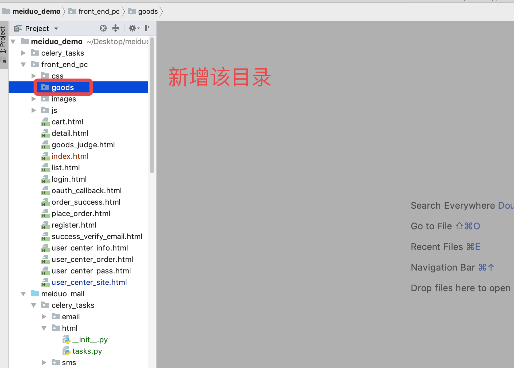

#### 让 celery 中间人自动捕获我们添加的任务:

> 在 celery_tasks.main 中:

```python
celery_apps.autodiscover_tasks(['celery_tasks.sms', 
                                'celery_tasks.email',
                                'celery_tasks.html'])
```

#### 页面模板

> 这里的页面模板有单独提供, 可以查看素材
>
> 将下面的代码添加在 detail.html 文件中, 然后放在 templates 目录下, 作为详情页模板

```html
<!DOCTYPE html PUBLIC "-//W3C//DTD XHTML 1.0 Transitional//EN" "http://www.w3.org/TR/xhtml1/DTD/xhtml1-transitional.dtd">
<html xmlns="http://www.w3.org/1999/xhtml" xml:lang="en">
<head>
    <meta http-equiv="Content-Type" content="text/html;charset=UTF-8">
    <title>美多商城-商品详情</title>
    <link rel="stylesheet" type="text/css" href="/css/reset.css">
    <link rel="stylesheet" type="text/css" href="/css/main.css">
    <script type="text/javascript" src="/js/host.js"></script>
    <script type="text/javascript" src="/js/vue-2.5.16.js"></script>
    <script type="text/javascript" src="/js/axios-0.18.0.min.js"></script>
</head>
<body>
    <div id="app" v-cloak>
    <div class="header_con">
        <div class="header">
            <div class="welcome fl">欢迎来到美多商城!</div>
            <div class="fr">
                <div v-if="username" class="login_btn fl">
                    欢迎您：<em>[[ username ]]</em>
                    <span>|</span>
                    <a @click="logout">退出</a>
                </div>
                <div v-else class="login_btn fl">
                    <a href="/login.html">登录</a>
                    <span>|</span>
                    <a href="/register.html">注册</a>
                </div>
                <div class="user_link fl">
                    <span>|</span>
                    <a href="/user_center_info.html">用户中心</a>
                    <span>|</span>
                    <a href="/cart.html">我的购物车</a>
                    <span>|</span>
                    <a href="/user_center_order.html">我的订单</a>
                </div>
            </div>
        </div>
    </div>

    <div class="search_bar clearfix">
            <a href="/index.html" class="logo fl"></a>
            <div class="search_wrap fl">
                <form method="get" action="/search.html" class="search_con">
                    <input type="text" class="input_text fl" name="q" placeholder="搜索商品">
                    <input type="submit" class="input_btn fr" name="" value="搜索">
                </form>
                <ul class="search_suggest fl">
                    <li><a href="#">索尼微单</a></li>
                    <li><a href="#">优惠15元</a></li>
                    <li><a href="#">美妆个护</a></li>
                    <li><a href="#">买2免1</a></li>
                </ul>
            </div>

            <div class="guest_cart fr">
            <a href="#" class="cart_name fl">我的购物车</a>
            <div class="goods_count fl" id="show_count">15</div>

            <ul class="cart_goods_show">
                <li>
                    
                    <h4>商品名称手机</h4>
                    <div>4</div>
                </li>
                <li>
                    
                    <h4>商品名称手机</h4>
                    <div>5</div>
                </li>
                <li>
                    
                    <h4>商品名称手机</h4>
                    <div>6</div>
                </li>
                <li>
                    
                    <h4>商品名称手机</h4>
                    <div>6</div>
                </li>
            </ul>            
        </div>

        </div>

        <div class="navbar_con">
                <div class="navbar">
                    <div class="sub_menu_con fl">
                        <h1 class="fl">商品分类</h1>
                        <ul class="sub_menu">
                            
                            <li>
                                <div class="level1">
                                    
                                    <a href="{{ channel.url }}">{{ channel.name }}</a>
                                    
                                </div>
                                <div class="level2">
                                    
                                    <div class="list_group">
                                        <div class="group_name fl">{{cat2.name}} &gt;</div>
                                        <div class="group_detail fl">
                                            
                                            <a href="/list.html?cat={{cat3.id}}">{{cat3.name}}</a>
                                            
                                        </div>
                                    </div>
                                    
                                </div>
                            </li>
                            
                        </ul>
                    </div>

                    <ul class="navlist fl">
                        <li><a href="">首页</a></li>
                        <li class="interval">|</li>
                        <li><a href="">真划算</a></li>
                        <li class="interval">|</li>
                        <li><a href="">抽奖</a></li>
                    </ul>
                </div>
            </div>

    <div class="breadcrumb">
        <a href="{{ goods.channel.url }}">{{ goods.category1.name }}</a>
        <span>></span>
        <span>{{ goods.category2.name }}</span>
        <span>></span>
        <a href="/list.html?cat={{ goods.category3.id }}">{{goods.category3.name }}</a>
    </div>

    <div class="goods_detail_con clearfix">
        <div class="goods_detail_pic fl"></div>
        <div class="goods_detail_list fr">
            <h3>{{ sku.name }}</h3>
            <p>{{ sku.caption }}</p>
            <div class="prize_bar">
                <span class="show_pirze">¥<em>{{ sku.price }}</em></span><span> 市场价￥{{sku.market_price}}</span>
                <a href="javascript:;" class="goods_judge">{{ sku.comments }}人评价</a>
            </div>
            <div class="goods_num clearfix">
                <div class="num_name fl">数 量：</div>
                <div class="num_add fl">
                    <input v-model="sku_count" type="text" class="num_show fl">
                    <a @click="sku_count++" class="add fr">+</a>
                    <a @click="on_minus()" class="minus fr">-</a>
                </div>
            </div>
            
            <div class="type_select">
                <label>{{ spec.name }}:</label>
                
                
                <a href="javascript:;" class="select">{{ option.value }}</a>
                
                <a href="/goods/{{option.sku_id}}.html">{{ option.value }}</a>
                
                <a href="javascript:;">{{ option.value }}</a>
                
                
            </div>
            
            <div class="total">总价：<em>[[sku_amount]]元</em></div>
            <div class="operate_btn">
                <a @click="add_cart" class="add_cart" id="add_cart">加入购物车</a>
            </div>
        </div>
    </div>

    <div class="main_wrap clearfix">
        <div class="l_wrap fl clearfix">
            <div class="new_goods">
                <h3>热销排行</h3>
                <ul>
                    <li v-for="sku in hots">
                        <a :href="sku.url"></a>
                        <h4><a :href="sku.url">[[sku.name]]</a></h4>
                        <div class="prize">￥[[sku.price]]</div>
                    </li>
                </ul>
            </div>
        </div>

        <div class="r_wrap fr clearfix">
            <ul class="detail_tab clearfix">
                <li @click="on_tab_content('detail')" :class="tab_content.detail?'active':''">商品详情</li>
                <li @click="on_tab_content('pack')" :class="tab_content.pack?'active':''">规格与包装</li>
                <li @click="on_tab_content('comment')" :class="tab_content.comment?'active':''">商品评价([[comments.length]])</li>
                <li @click="on_tab_content('service')" :class="tab_content.service?'active':''">售后服务</li>
            </ul>
            <div @click="on_tab_content('detail')" class="tab_content" :class="tab_content.detail?'current':''">
                <dl>
                    <dt>商品详情：</dt>
                    <dd>{{ goods.desc_detail|safe }}</dd>
                </dl>
            </div>
            <div @click="on_tab_content('pack')" class="tab_content" :class="tab_content.pack?'current':''">
                <dl>
                    <dt>规格与包装：</dt>
                    <dd>{{ goods.desc_pack|safe }}</dd>
                </dl>
            </div>
            <div @click="on_tab_content('comment')" class="tab_content" :class="tab_content.comment?'current':''">
                <ul class="judge_list_con">
                    <li class="judge_list fl" v-for="comment in comments">
                        <div class="user_info fl">
                            <b>[[comment.username]]</b>
                        </div>
                        <div class="judge_info fl">
                            <div :class="comment.score_class"></div>
                            <div class="judge_detail">[[comment.comment]]</div>
                        </div>
                    </li>
                </ul>
            </div>
            <div @click="on_tab_content('service')" class="tab_content" :class="tab_content.service?'current':''">
                <dl>
                    <dt>售后服务：</dt>
                    <dd>{{ goods.desc_service|safe }}</dd>
                </dl>
            </div>
        </div>
    </div>

    <div class="footer">
        <div class="foot_link">
            <a href="#">关于我们</a>
            <span>|</span>
            <a href="#">联系我们</a>
            <span>|</span>
            <a href="#">招聘人才</a>
            <span>|</span>
            <a href="#">友情链接</a>
        </div>
        <p>CopyRight © 2016 北京美多商业股份有限公司 All Rights Reserved</p>
        <p>电话：010-****888    京ICP备*******8号</p>
    </div>
    </div>
    <script type="text/javascript">
        var price = {{sku.price}};
        var cat = {{ goods.category3.id }};
    </script>
    <script type="text/javascript" src="/js/common.js"></script>
    <script type="text/javascript" src="/js/detail.js"></script>
</body>
</html>
```

#### 效果演示:

我们已经在 celery 中配置了当前的异步任务, 现在可以尝试着调用一下, 查看是否能够生成 detail 页面的静态文件:

##### 打开一个命令行:

```shell
# 第一步, 进入 shell:
python manage.py shell

# 第二步, 导入 celery 任务中的函数:
from celery_tasks.html.tasks import generate_static_sku_detail_html

# 第三步, 将该函数添加到 celery 队列中: 
generate_static_sku_detail_html.delay(1)
```

如图所示:

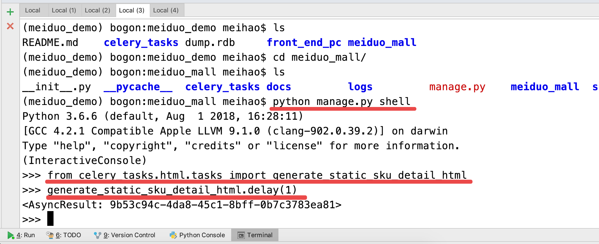

##### 打开另一个命令行:

调用 celery 的执行者( worker ) :

```python
celery -A celery_tasks.main worker -l info
```

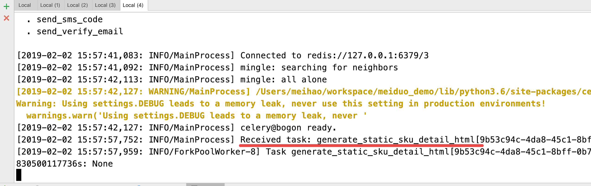

我们会发现, 当前的执行者, 执行了这个任务: 并且还在前端的 goods 目录中生成了一个 1.html 的商品详情页静态文件.

如下所示:

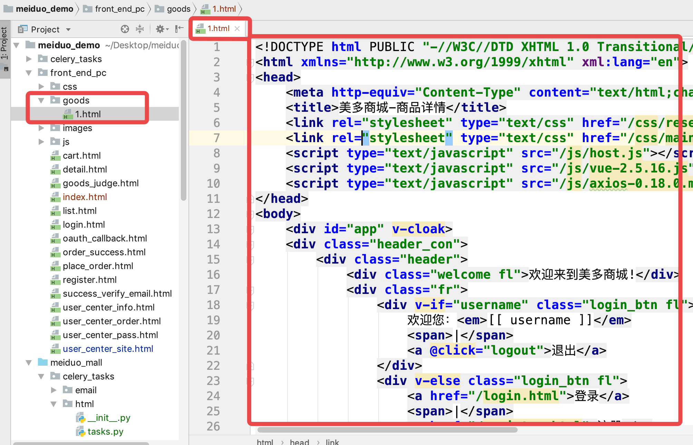

这时, 通过浏览器查看生成的页面:

```
http://127.0.0.1:8080/goods/1.html
```

我们会发现, 可能访问不到, 原因是新生成的页面中, 调用了 js 目录下的一个 detail.js 文件.

我们需要在 js目录 中新增 detail.js 后. ( 下面有代码 )

就能够正常访问到:

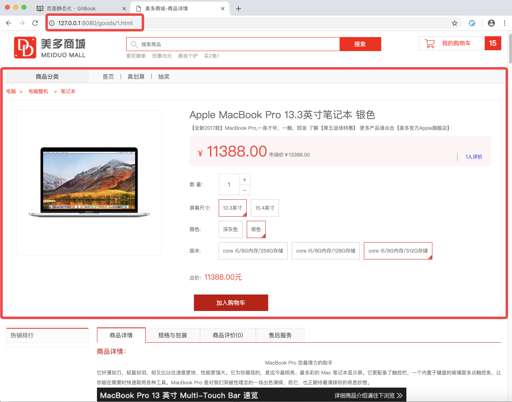


## 一次性生成所有页面

> 除了上面的生成方式以外, 我们还可以一次性的将所有的商品详情页全部生成出来.
>
> 所有的商品一个一个依次生成静态页面,非常费时, 所以我们可以让其一次性的全部生成出来.

##### 利用脚本工具

> 我们在 scripts 目录中 创建一个新的脚本文件, 名称叫做: regenerate_detail_html.py
>
> 该脚本一旦执行, 就会将所有的商品详情页都生成出来.

```python
# 导入所需要的依赖包
from django.template import loader
from django.conf import settings
from goods.utils import get_categories
from goods.models import SKU


if __name__ == '__main__':
    # 获取所有的商品信息
    skus = SKU.objects.all()
    # 遍历拿出所有的商品: 
    for sku in skus:
        print(sku.id)
        # 调用我们之前在 celery_tasks.html.tasks 中写的生成商品静态页面的方法:
        # 我们最好把这个函数单独复制过来, 这样可以不依靠 celery, 否则必须要开启celery
        generate_static_sku_detail_html(sku.id)
```

添加生成静态页面的代码. 这个代码和 celery_tasks.html.tasks 里面的一样:

```python
# 复制 celery_tasks.html.tasks 中生成商品静态页面的函数:
def get_goods_and_spec(sku_id):

    # ======================== 获取该商品和该商品对应的规格选项id ===================================
    try:
        # 根据 sku_id 获取该商品(sku)
        sku = SKU.objects.get(id=sku_id)
        # 获取该商品的图片
        sku.images = sku.skuimage_set.all()
    except Exception as e:
        return http.JsonResponse({'code':400,
                                  'errmsg':'获取数据失败'})

    # 获取该商品的所有规格: [颜色, 内存大小, ...]
    sku_specs = sku.skuspecification_set.order_by('spec_id')

    sku_key = []
    # 根据该商品的规格(例如颜色), 获取对应的规格选项id(例如黑色id)
    # 保存到 [] 中
    for spec in sku_specs:
        sku_key.append(spec.option.id)

    # ============================ 获取类别下所有商品对应的规格选项id================================

    # 获取该商品的类别(spu,这里的spu就是goods)
    goods = sku.goods

    # 获取该类别下面的所有商品
    skus = goods.sku_set.all()
    
    dict = {}
    for sku in skus:
        # 获取每一个商品(sku)的规格参数
        s_specs = sku.skuspecification_set.order_by('spec_id')

        # 根据该商品的规格(例如颜色), 获取对应的规格选项id(例如黑色id)
        # 保存到 [] 中
        key = []
        for spec in s_specs:
            key.append(spec.option.id)
            
        # 把 list 转为 () 拼接成 k : v 保存到dict中:
        dict[tuple(key)] = sku.id

    # ============================ 在每个选项上绑定对应的sku_id值 ===================================
    goods_specs = goods.goodsspecification_set.order_by('id')

    for index, spec in enumerate(goods_specs):
        # 复制当前sku的规格键
        key = sku_key[:]
        # 该规格的选项
        spec_options = spec.specificationoption_set.all()
        # spec_options = spec.options.all()
        for option in spec_options:
            # 在规格参数sku字典中查找符合当前规格的sku
            key[index] = option.id
            option.sku_id = dict.get(tuple(key))

        spec.spec_options = spec_options

    # 渲染模板，生成静态html文件
    context = {
        'categories': categories,
        'goods': goods,
        'specs': goods_specs,
        'sku': sku
    }

    template = loader.get_template('detail.html')
    html_text = template.render(context)
    file_path = os.path.join(settings.GENERATED_STATIC_HTML_FILES_DIR, 
                             'goods/'+str(sku_id)+'.html')
    with open(file_path, 'w') as f:
        f.write(html_text)
```

给文件增加权限:

```python
chmod  +x  regenerate_detail_html.py
```

然后运行文件:

```python
./regenerate_detail_html.py
```

给文件增加解释器, 因为我们创建的是 .py 文件, 所以需要有 python 解释器才能够执行该文件:

在文件的最上方增加:

```
#!虚拟环境中的python路径(这里可以通过which python获取, windows中是where python)
```

都设置好了之后, 我们运行还是会出错.

> 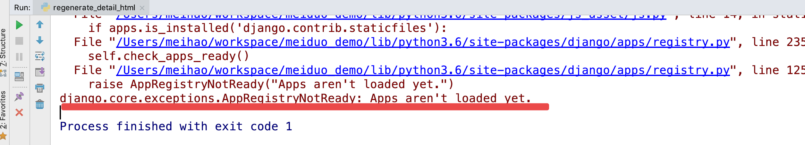

这里我们调用了 django 项目中的内容, 所以需要让 django 初始化一次才可以:

```python
import django
django.setup()
```

添加之后, 发现还是不行, 这次报的错误如下所示:

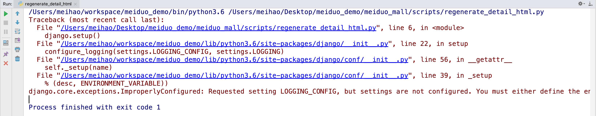

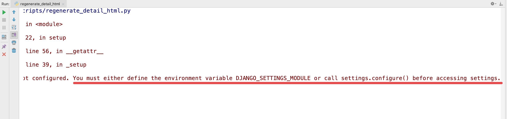

这次我们会发现是因为没有配置项目的全局环境变量:

```python
import os
os.environ['DJANGO_SETTINGS_MODULE'] = 'meiduo_mall.settings.dev'
```

这次添加完成后, 我们会发现还是会有问题, 这次的问题是上面导入的环境变量引起的:

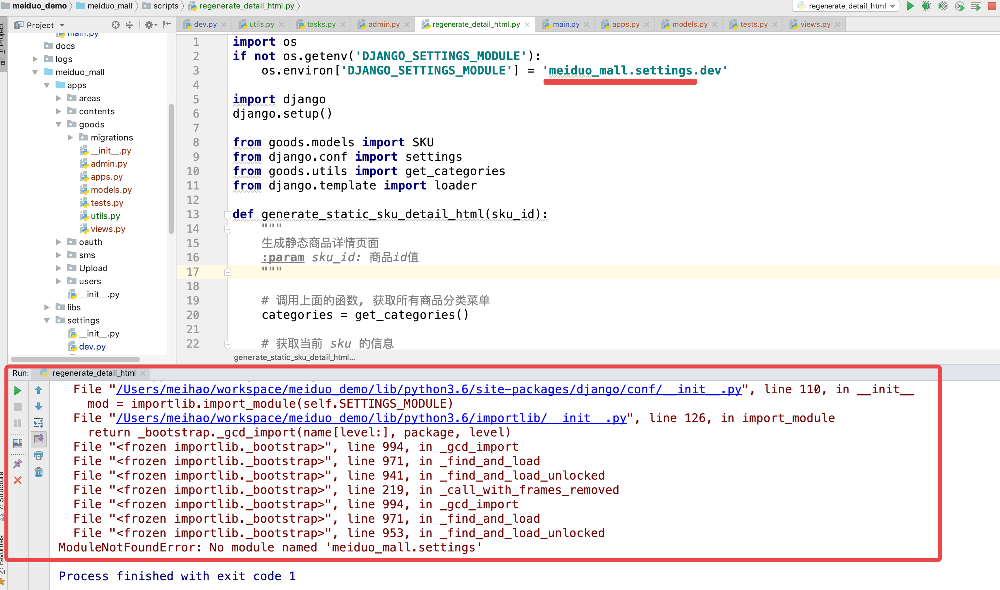

> 我们会发现, 这里的 meiduo_mall.settings 找不到了.

这里我们把 scripts 的上级添加到搜索包里去:

```python
import sys
sys.path.insert(0, '../')
```

这样就可以正常运行了:

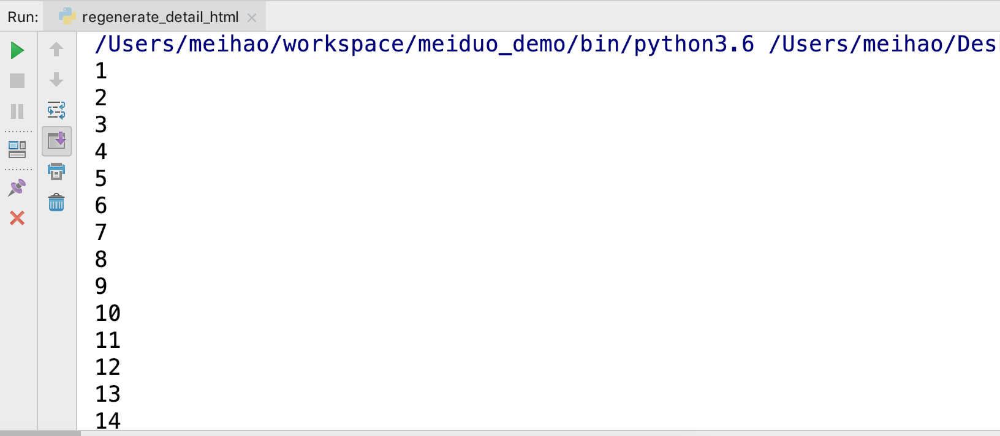

所以我们最终的代码是:

```python
#!/usr/bin/env python

"""
最上面的注释意思是: 使用 python 环境来执行当前的代码
功能：手动生成所有SKU的静态detail html文件
使用方法:   ./regenerate_detail_html.py
"""
import sys
sys.path.insert(0, '../')

# 设置Django运行所依赖的环境变量
import os
    os.environ['DJANGO_SETTINGS_MODULE'] = 'meiduo_mall.settings.dev'

# 让Django进行一次初始化
import django
django.setup()

# 导入所需要的依赖包
from django.template import loader
from django.conf import settings
from goods.utils import get_categories
from goods.models import SKU

# 复制 celery_tasks.html.tasks 中生成商品静态页面的函数:
def get_goods_and_spec(sku_id):

    # ======================== 获取该商品和该商品对应的规格选项id ===================================
    try:
        # 根据 sku_id 获取该商品(sku)
        sku = SKU.objects.get(id=sku_id)
        # 获取该商品的图片
        sku.images = sku.skuimage_set.all()
    except Exception as e:
        return http.JsonResponse({'code':400,
                                  'errmsg':'获取数据失败'})

    # 获取该商品的所有规格: [颜色, 内存大小, ...]
    sku_specs = sku.skuspecification_set.order_by('spec_id')

    sku_key = []
    # 根据该商品的规格(例如颜色), 获取对应的规格选项id(例如黑色id)
    # 保存到 [] 中
    for spec in sku_specs:
        sku_key.append(spec.option.id)

    # ============================ 获取类别下所有商品对应的规格选项id================================

    # 获取该商品的类别(spu,这里的spu就是goods)
    goods = sku.goods

    # 获取该类别下面的所有商品
    skus = goods.sku_set.all()
    
    dict = {}
    for sku in skus:
        # 获取每一个商品(sku)的规格参数
        s_specs = sku.skuspecification_set.order_by('spec_id')

        # 根据该商品的规格(例如颜色), 获取对应的规格选项id(例如黑色id)
        # 保存到 [] 中
        key = []
        for spec in s_specs:
            key.append(spec.option.id)
            
        # 把 list 转为 () 拼接成 k : v 保存到dict中:
        dict[tuple(key)] = sku.id

    # ============================ 在每个选项上绑定对应的sku_id值 ===================================
    goods_specs = goods.goodsspecification_set.order_by('id')

    for index, spec in enumerate(goods_specs):
        # 复制当前sku的规格键
        key = sku_key[:]
        # 该规格的选项
        spec_options = spec.specificationoption_set.all()
        # spec_options = spec.options.all()
        for option in spec_options:
            # 在规格参数sku字典中查找符合当前规格的sku
            key[index] = option.id
            option.sku_id = dict.get(tuple(key))

        spec.spec_options = spec_options

    # 渲染模板，生成静态html文件
    context = {
        'categories': categories,
        'goods': goods,
        'specs': goods_specs,
        'sku': sku
    }

    template = loader.get_template('detail.html')
    html_text = template.render(context)
    file_path = os.path.join(settings.GENERATED_STATIC_HTML_FILES_DIR, 
                             'goods/'+str(sku_id)+'.html')
    with open(file_path, 'w', encoding='utf-8') as f:
        f.write(html_text)


if __name__ == '__main__':
    # 获取所有的商品信息
    skus = SKU.objects.all()
    # 遍历拿出所有的商品: 
    for sku in skus:
        print(sku.id)
        # 调用我们之前在 celery_tasks.html.tasks 中写的生成商品静态页面的方法:
        # 我们最好把这个函数单独复制过来, 这样可以不依靠 celery, 否则必须要开启celery
        generate_static_sku_detail_html(sku.id)
```

效果为:

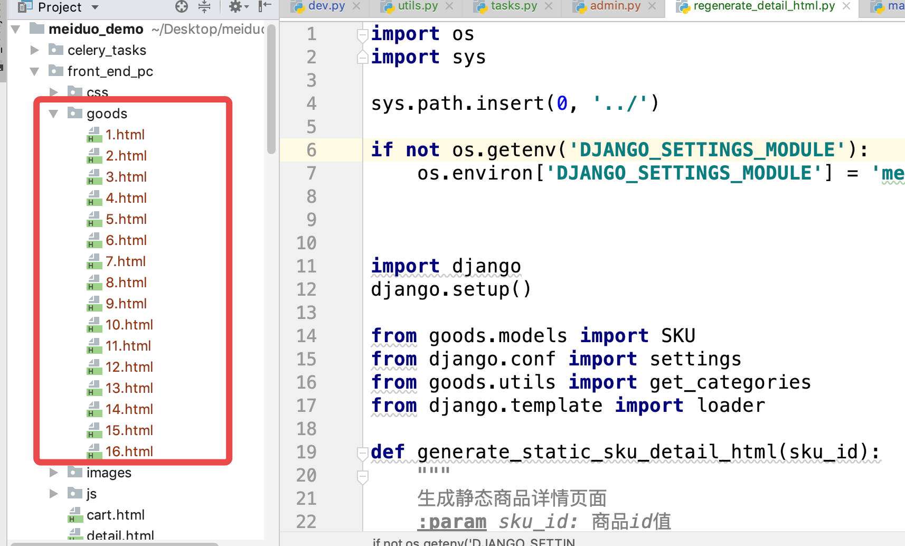


