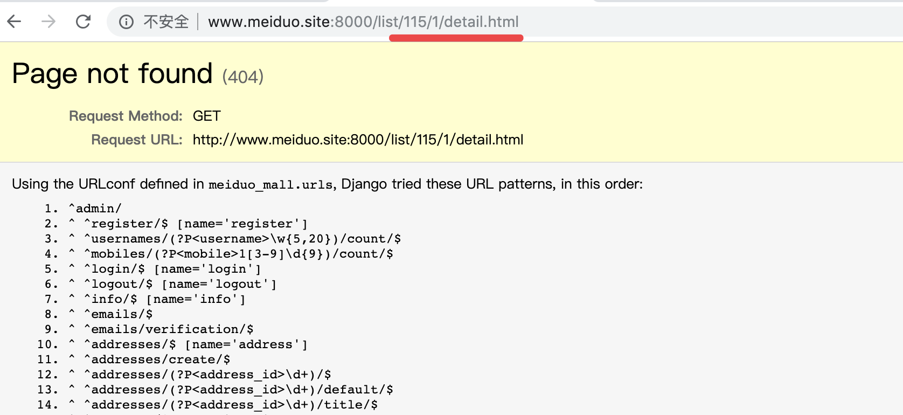

# 展示详情页数据

### 1. 查询和渲染SKU详情信息

> 在 detail.html 页面中更新如下数据:

```html
<div class="goods_detail_con clearfix">
    <div class="goods_detail_pic fl"></div>
    <div class="goods_detail_list fr">
        <h3>{{ sku.name }}</h3>
        <p>{{ sku.caption }}</p>
        <div class="price_bar">
            <span class="show_pirce">¥<em>{{ sku.price }}</em></span>
            <a href="javascript:;" class="goods_judge">18人评价</a>
        </div>
        <div class="goods_num clearfix">
            <div class="num_name fl">数 量：</div>
            <div class="num_add fl">
                <input v-model="sku_count" @blur="check_sku_count" type="text" class="num_show fl">
                <a @click="on_addition" class="add fr">+</a>
                <a @click="on_minus" class="minus fr">-</a>
            </div> 
        </div>
        {#...商品规格...#}
        <div class="total" v-cloak>总价：<em>[[ sku_amount ]]元</em></div>
        <div class="operate_btn">
            <a href="javascript:;" class="add_cart" id="add_cart">加入购物车</a>				
        </div>
    </div>
</div>
```

> 提示：为了实现用户选择商品数量的局部刷新效果，我们将商品单价从模板传入到Vue.js


### 2. 查询和渲染SKU规格信息

> **1.查询SKU规格信息**

##### 调用封装好的函数: 

> 在 goods.utils.py 文件中添加如下函数: 

```python
def get_goods_and_spec(sku_id):
    # 获取当前sku的信息
    try:
        sku = SKU.objects.get(id=sku_id)
        sku.images = sku.skuimage_set.all()
    except SKU.DoesNotExist:
        return render(request, '404.html')

    # 面包屑导航信息中的频道
    goods = sku.goods
    
    # 构建当前商品的规格键
    # sku_key = [规格1参数id， 规格2参数id， 规格3参数id, ...]
    sku_specs = sku.skuspecification_set.order_by('spec_id')

    sku_key = []
    for spec in sku_specs:
        sku_key.append(spec.option.id)

    # 获取当前商品的所有SKU
    skus = goods.sku_set.all()

    # 构建不同规格参数（选项）的sku字典
    # spec_sku_map = {
    #     (规格1参数id, 规格2参数id, 规格3参数id, ...): sku_id,
    #     (规格1参数id, 规格2参数id, 规格3参数id, ...): sku_id,
    #     ...
    # }
    spec_sku_map = {}
    for s in skus:
        # 获取sku的规格参数
        s_specs = s.skuspecification_set.order_by('spec_id')

        # 用于形成规格参数-sku字典的键
        key = []
        for spec in s_specs:
            key.append(spec.option.id)
        # 向规格参数-sku字典添加记录
        spec_sku_map[tuple(key)] = s.id

    # 获取当前商品的规格信息
    # specs = [
    #    {
    #        'name': '屏幕尺寸',
    #        'options': [
    #            {'value': '13.3寸', 'sku_id': xxx},
    #            {'value': '15.4寸', 'sku_id': xxx},
    #        ]
    #    },
    #    {
    #        'name': '颜色',
    #        'options': [
    #            {'value': '银色', 'sku_id': xxx},
    #            {'value': '黑色', 'sku_id': xxx}
    #        ]
    #    },
    #    ...
    # ]
    goods_specs = goods.goodsspecification_set.order_by('id')

    # 若当前sku的规格信息不完整，则不再继续
    if len(sku_key) < len(goods_specs):
        return
    for index, spec in enumerate(goods_specs):
        # 复制当前sku的规格键
        key = sku_key[:]
        # 该规格的选项
        spec_options = spec.specificationoption_set.all()
  
        for option in spec_options:
            # 在规格参数sku字典中查找符合当前规格的sku
            key[index] = option.id
            option.sku_id = spec_sku_map.get(tuple(key))

        spec.spec_options = spec_options

    data = {
        'goods':goods,
        'goods_specs':goods_specs,
        'sku':sku
    }
    
    return data
```

> 上面的函数帮助我们封装了:
>
> 该类物品( sku )
>
> 和该类物品( sku )所对应的所有产品( goods )
>
> 以及这些商品( goods )的所有规格选项( goods_specs )
>
> 我们将上面函数的封装在下面进行调用: 

```python
from goods.utils import get_goods_and_spec

class DetailView(View):

    def get(self, request, sku_id):
        """提供商品详情页"""

        # 商品分类菜单
        categories = get_categories()

        # 调用封装的函数, 根据 sku_id 获取对应的
        # 1. 类别( sku ) 
        # 2. 商品( goods )
        # 3. 商品规格( spec )
        data = get_goods_and_spec(sku_id, request)

        # 获取面包屑导航: 
        breadcrumb = get_breadcrumb(data['goods'].category3)

        # 拼接参数，生成静态 html 文件
        context = {
            'categories': categories,
            'goods': data.get('goods'),
            'specs': data.get('goods_specs'),
            'sku': data.get('sku'),
            'breadcrumb':breadcrumb
        }

        return render(request, 'detail.html', context)
```

##### 注意: 

接口我们已经定义完成了, 但是想要跳转到 detail 详情页

一般我们会通过点击 list 页面的某一个商品进行跳转: 

但是, 点击商品时, 会发现跳转不了, 并且报错: 



为什么会出现上述的错误呢?   我们可以检查一下源码, 发现: 

```html
<li>
    <a href="detail.html"></a>
    <h4><a href="detail.html">360手机 N6 Pro 全网通 6GB+128GB 极夜黑</a></h4>
    <div class="operate">
        <span class="price">￥16.80</span>
        <span class="unit">台</span>
        <a href="#" class="add_goods" title="加入购物车"></a>
    </div>
</li>
```

我们通过代码, 会发现: 点击 a 标签之后, href 中没有使用 jinja2 的模板语法, 所以导致跳转的 url 不对, 没法进行跳转.

解决: 

更改 list.html 中的代码, 使其变成一下格式: 

```html
<ul class="goods_type_list clearfix">
    
        <li>
            <a href="{{ url('goods:detail', args=(sku.id,)) }}">
                
            </a>
            <h4>
                <a href="{{ url('goods:detail', args=(sku.id,)) }}">{{ sku.name }}</a>
            </h4>
            <div class="operate">
                <span class="price">￥{{ sku.price }}</span>
                <span class="unit">台</span>
                <a href="#" class="add_goods" title="加入购物车"></a>
            </div>
        </li>
     
</ul>
```

> 则可以正常跳转, 但是跳转之后还是会遇到样式等问题, 这时我们需要添加如下的代码: 

> **2.渲染SKU规格信息**

```html
{#...商品规格信息...#}


<div class="type_select">
    <label>{{ spec.name }}:</label>
    
        
        <a href="javascript:;" class="select">{{ option.value }}</a>
        
        <a href="{{ url('goods:detail', args=(option.sku_id, )) }}">{{ option.value }}</a>
        
        <a href="javascript:;">{{ option.value }}</a>
        
    
</div>

```

加载样式: 

```html
    <link rel="stylesheet" type="text/css" href="{{ static('css/reset.css') }}">
    <link rel="stylesheet" type="text/css" href="{{ static('css/main.css') }}">
    <script type="text/javascript" src="{{ static('js/host.js') }}"></script>
    <script type="text/javascript" src="{{ static('js/vue-2.5.16.js') }}"></script>
    <script type="text/javascript" src="{{ static('js/axios-0.18.0.min.js') }}"></script>
```

加载 logo : 

```html
 <!--更改前端图标的代码, 使用 static() 的形式添加: -->
 
```

加载 js 部分: 

```html
    <script>
        var price = "{{ sku.price }}";
        var category_id = "{{ goods.category3.id }}";
        var sku_id = "{{ sku.id }}";
    </script>
    <script type="text/javascript" src="{{ static('js/common.js') }}"></script>
    <script type="text/javascript" src="{{ static('js/detail.js') }}"></script>
```

###### 加载面包屑效果:

```html
    <!-- 面包屑导航 -->
    <div class="breadcrumb">
        <a href="{{ breadcrumb.cat1.url }}">{{ breadcrumb.cat1.name }}</a>
        <span>></span>
        <a href="javascript:;">{{ breadcrumb.cat2.name }}</a>
        <span>></span>
        <a href="javascript:;">{{ breadcrumb.cat3.name }}</a>
    </div>
```

###### 增加详情页的商品分类代码: 

```html
<ul class="sub_menu">
    
    <li>
        <div class="level1">
            
            <a href="{{ channel.url }}">{{ channel.name }}</a>
            
        </div>
        <div class="level2">
            
            <div class="list_group">
                <div class="group_name fl">{{ cat2.name }} &gt;</div>
                <div class="group_detail fl">
                    
                    <a href="/list/{{ cat3.id }}/1/">{{ cat3.name }}</a>
                    
                </div>
            </div>
            
        </div>
    </li>
    
</ul>
```


### 3. 查询和渲染详情、包装和售后信息

> 商品详情、包装和售后信息被归类到商品SPU中，`sku.spu`关联查询就可以找到该`SKU`的`SPU`信息。

```html
<div class="r_wrap fr clearfix">
    <ul class="detail_tab clearfix">
        <li @click="on_tab_content('detail')" :class="tab_content.detail?'active':''">商品详情</li>
        <li @click="on_tab_content('pack')" :class="tab_content.pack?'active':''">规格与包装</li>
        <li @click="on_tab_content('service')" :class="tab_content.service?'active':''">售后服务</li>
        <li @click="on_tab_content('comment')" :class="tab_content.comment?'active':''">商品评价(18)</li>
    </ul>
    <div @click="on_tab_content('detail')" class="tab_content" :class="tab_content.detail?'current':''">
        <dl>
            <dt>商品详情：</dt>
            <dd>{{ goods.desc_detail|safe }}</dd>
        </dl>
    </div>
    <div @click="on_tab_content('pack')" class="tab_content" :class="tab_content.pack?'current':''">
        <dl>
            <dt>规格与包装：</dt>
            <dd>{{ goods.desc_pack|safe }}</dd>
        </dl>
    </div>
    <div @click="on_tab_content('comment')" class="tab_content" :class="tab_content.comment?'current':''">
        <ul class="judge_list_con">
            <li class="judge_list fl" v-for="comment in comments">
                <div class="user_info fl">
                    <b>[[comment.username]]</b>
                </div>
                <div class="judge_info fl">
                    <div :class="comment.score_class"></div>
                    <div class="judge_detail">[[comment.comment]]</div>
                </div>
            </li>
        </ul>
    </div>
    <div @click="on_tab_content('service')" class="tab_content" :class="tab_content.service?'current':''">
        <dl>
            <dt>售后服务：</dt>
            <dd>{{ goods.desc_service|safe }}</dd>
        </dl>
    </div>
</div>
```